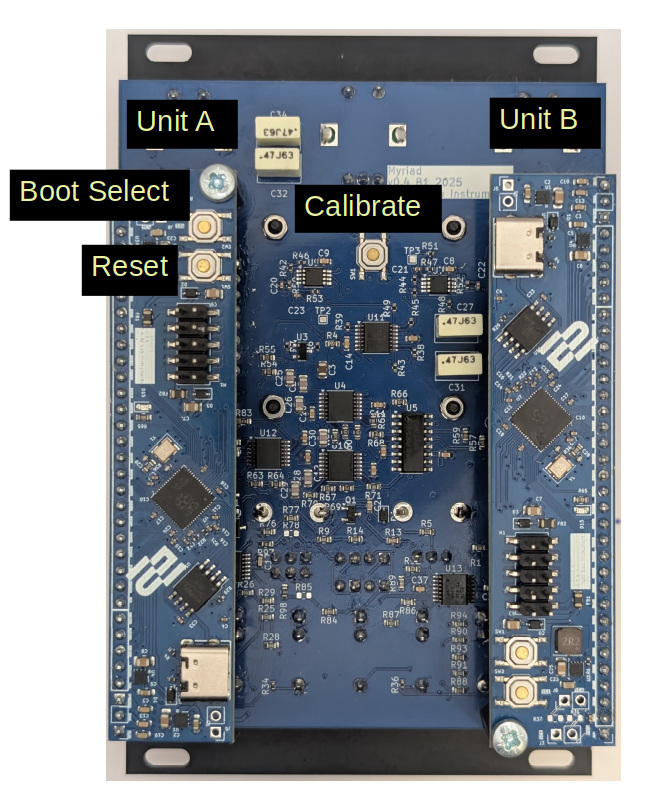

## Firmware

Myriad has two microcontrollers, each of which has it's own firmware.  If you are making a kit, you will need to load the firmwares onto the module.  If you have a built module, it will come pre-installed with firmware, but there may be an update available that you would like to install.  To see which version of the firmware your module is running, press the calibration button on the back; the firmware date and version number will be visible. Firmware can be installed from most operating systems.  

Looking at the back of a Myriad, there are two *ELI2040c* boards, each of which hosts a microcontroller.  Each board has a USB-C connector. 

Follow these steps to update the firmware:

### 1. Download firmware files.

The latest firmware: [https://github.com/Emute-Lab-Instruments/Myriad/releases](https://github.com/Emute-Lab-Instruments/Myriad/releases)

### 2. Disconnect Myriad from eurorack power

### 3. Connect your computer to unit A

Use the USB-C connector. You will see the screen running from USB power, but the module does not make sound without full eurorack power.

### 4. Place unit A in *boot select* mode.

While holding down the `boot select` button, press and release the `reset` button, then release `boot select`.  A new volume should now appear on your computer's file system.

### 5. Copy the firmware file

Drag or copy the *Myriad A* firmware to the volume that just appeared. The microcontroller will now reboot with the new firmware, and the volume will dissapear from your computer

### 6. Disconnect the USB cable

### 7. Install Unit B

Now repeat from step 2, with unit B and the Myriad B firmware

