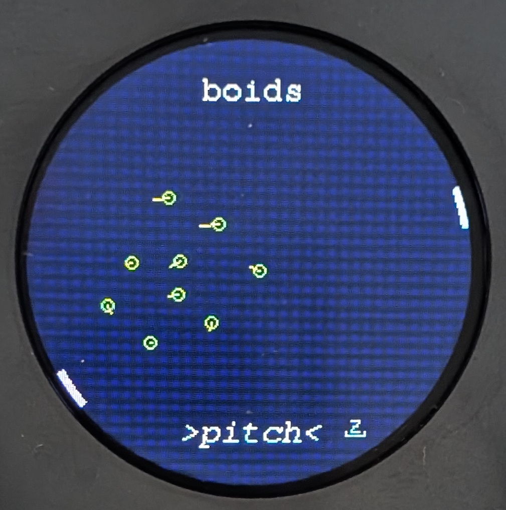
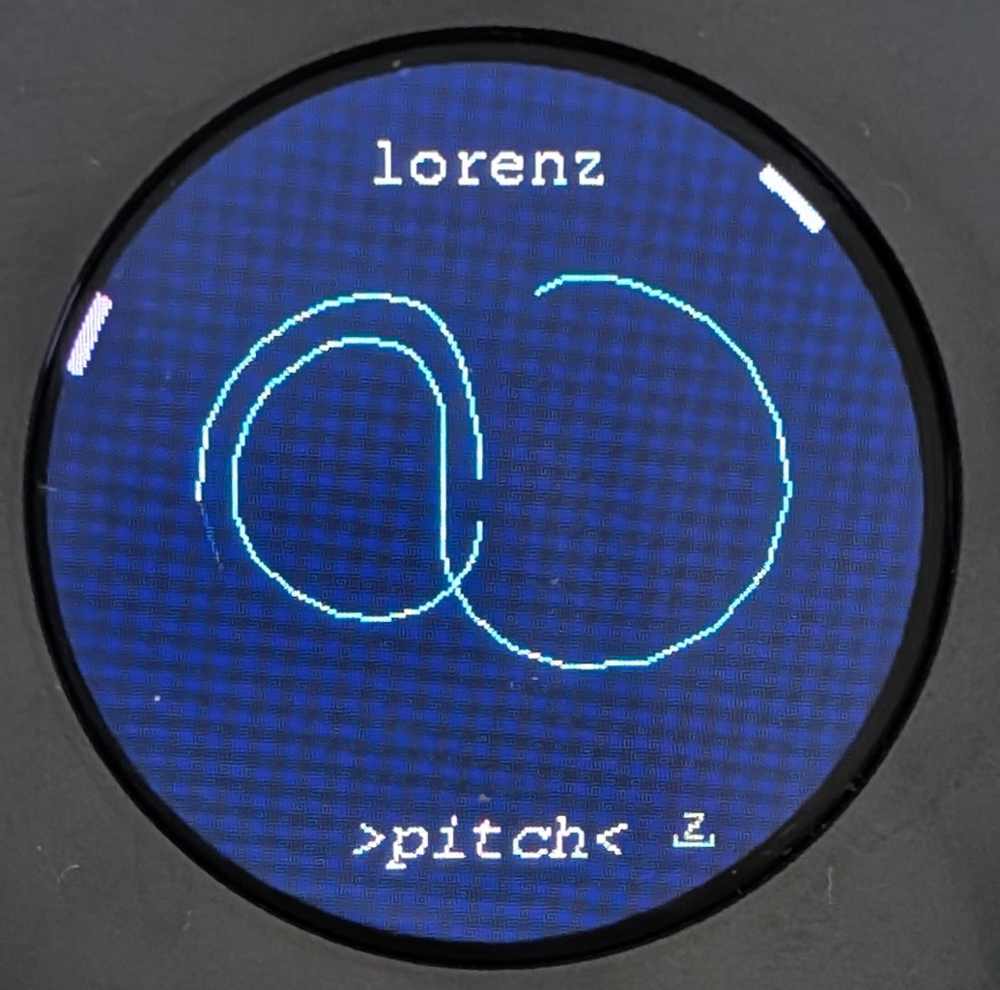
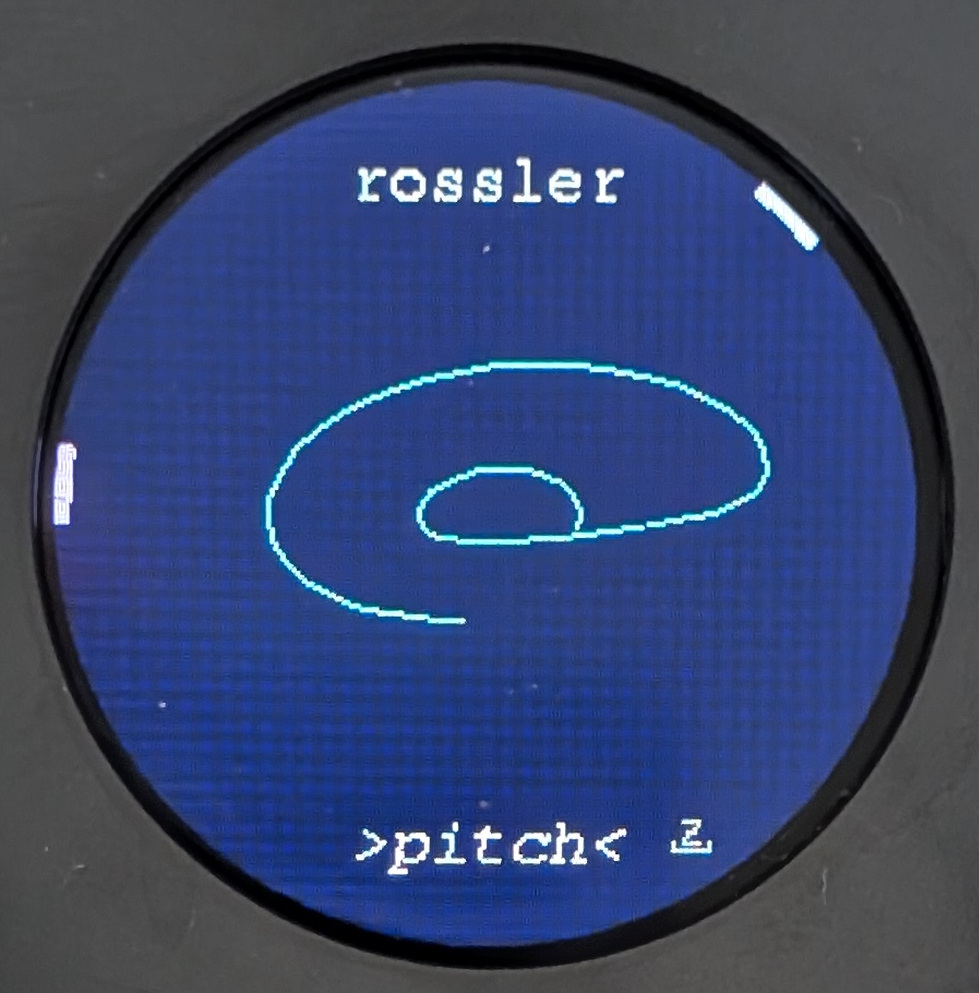
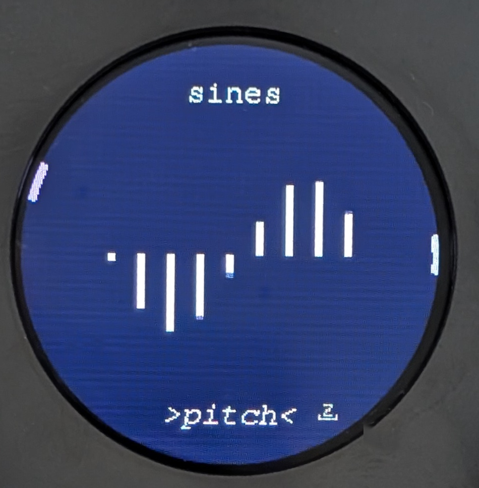
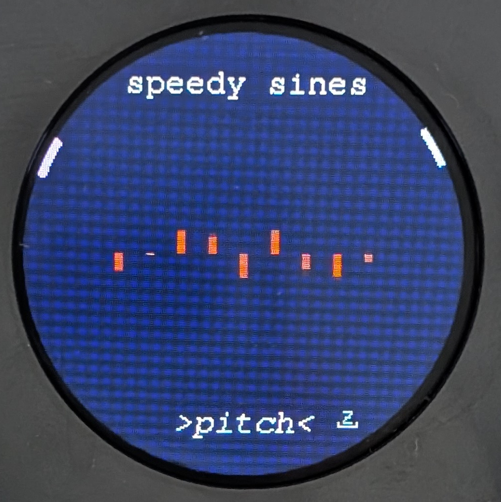
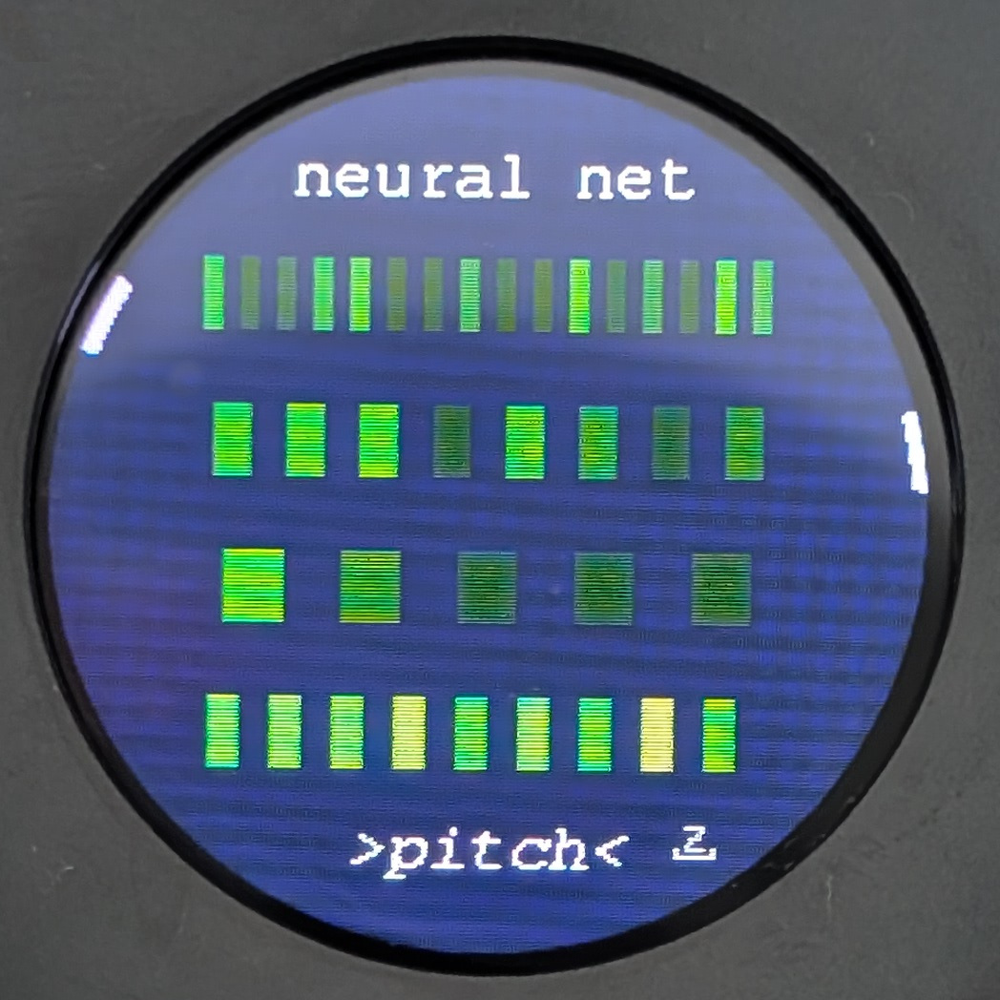
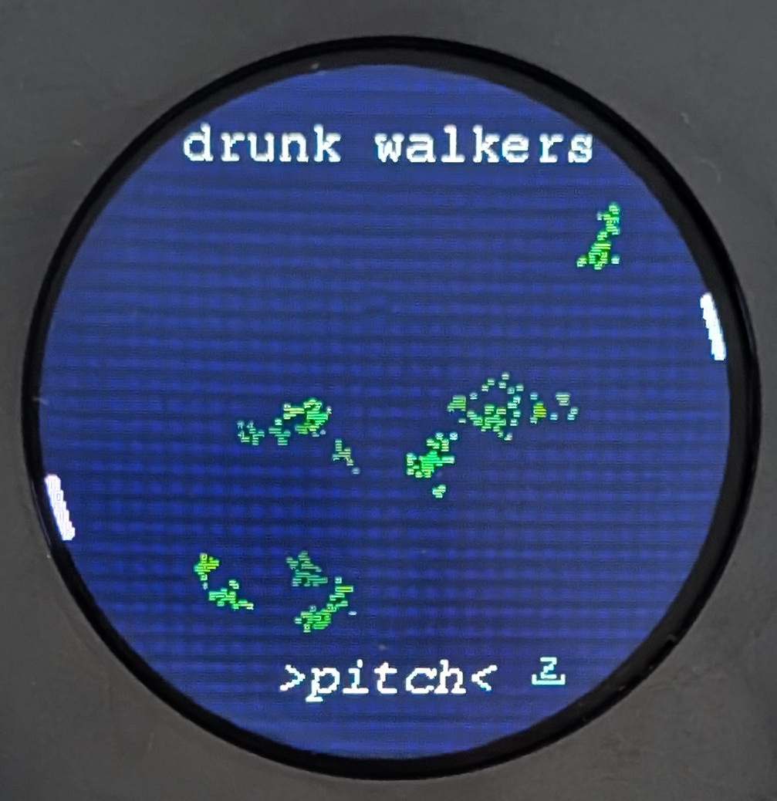

# Meta Modulators

Meta modulators are algorithmic systems that can add some extra movement and complexity to the oscillators. 

Pushing `Y` alternates between oscillator and meta-modulator screens.

<iframe width="560" height="315" src="https://www.youtube.com/embed/lJBrkULPvJM?si=vvqFYUzgyXMb0KzL&amp;start=163" title="YouTube video player" frameborder="0" allow="accelerometer; autoplay; clipboard-write; encrypted-media; gyroscope; picture-in-picture; web-share" referrerpolicy="strict-origin-when-cross-origin" allowfullscreen></iframe>

## Controls

### Modulation Targets

The outputs of the meta-modulations can be mapped to pitch, ***&#x03F5;***, or both.  Push `Z` to cycle through these options.

### Speed and Depth

Rotating `X` and `Z` controls speed and depth of modulation.

## Boids

Boids ([Reynolds, 1986](https://dl.acm.org/doi/10.1145/37401.37406)) is an artifical life algorithm, simulating the flocking of birds.  The boids try to follow three rules:

1. Coherence: steer towards other boids
2. Separation: avoid flying into other boids
3. Alignment: match the speed and direction of other boids

From these simple rules, complex behaviour emerges.  The velocity of each of the nine boids modulates the oscillators.

## Lorenz Attractor

The is a dynamical system with chaotic behaviours, [created by meterologist Edward Lorenz in 1963](https://www.nature.com/articles/35023206).  The system is started from initial conditions that result in a butterfly shape.  The system moves in three dimensions (although we view it in 2D); the position, velocity and acceleration of the system create nine measurements which are used as modulation.

## Rossler Attractor

Another 3D system with chaotic dynamics, published by biochemist Otto Rössler in the 1970s.

## Sines

A set of nine sinewave oscillators, all running at the same speed, with a 40 degree phase difference from each other.

## Speedy Sines

Nine sinewave oscillators, with 40 degree phase differences, and also varying in speed.

## Neural Network

The neural network is an source of complexity.  It has five inputs:  readings from frequency, spread, &#x03F5; and interval controls, and a phasor which changes speed and depth with the meta-modulation screen controls.  The nine outputs of the neural network are used for modulation.  The network (a multilayer perceptron) will have a nonlinear response to its inputs, creating some strange and unpredictable modulation.

The neural network comes from an [Emute Lab](https://www.emutelab.org/) research project [Musically Embodied Machine Learning](https://musicallyembodiedml.github.io/).

## Drunk Walkers

These walkers have had a few too many. So much that they can't even walk in a straight line, just in the direction of a linearly distributed random vector each step.  While they stagger obliviously across the screen, their distance from the centre determines the modulation of your oscillators.  They will never sober up.
