# Models

Myriad has a selection of *oscillator models*; each one is driven by a digital algorithm, using Bitwave Synthesis. Bitwave is a collection of methods for creating high-frequency streams of binary patterns, that are converted into sound using analog circuitry.  Each model has two paramters of control: frequency and ***&#x03F5;***.  The ***&#x03F5;*** parameter creates tonal changes, and works in a different way in each model.  

<iframe width="560" height="315" src="https://www.youtube.com/embed/lJBrkULPvJM?si=Jw99--LgZThrmn5r&amp;start=500" title="YouTube video player" frameborder="0" allow="accelerometer; autoplay; clipboard-write; encrypted-media; gyroscope; picture-in-picture; web-share" referrerpolicy="strict-origin-when-cross-origin" allowfullscreen></iframe>

## (0) Saw

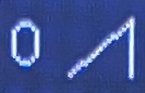

Generates a saw wave.

***&#x03F5;*** controls the pulse width of the saw wave

## (1) Sharktooth

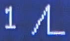

This is a variant of the saw wave, with tonal variations created by smoothing the error feedback in delta-sigma modulation.

***&#x03F5;*** controls the level of smoothing. Higher values create a thinner sound.  Response to the parameter is frequency dependent.  This model will not reach high frequencies when this is set to a high value.

## (2) Pulse

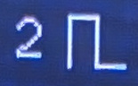

A pulse wave.

***&#x03F5;*** controls the pulse width.

## (3) Multipulse-10

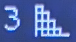

Each cycle of a waveform smaller pulse waves,which vary in pulse width.

***&#x03F5;*** controls the pulse width.  Moving this control higher introduces additional frequencies.

## (4) Multipulse-14

A variant of multipulse-10.

***&#x03F5;*** controls the pulse width.  Moving this control higher introduces additional frequencies.

## (5) Triangle

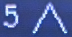

***&#x03F5;*** varies the position of the peak point of the triangle.

## (6) TriFB

A variant of the triangle model,using an intervention into the delta-sigma modulation feedback lopp to modulate tone.

***&#x03F5;*** scales delta-sigma modulation error feedback, creating tonal variations.

## (7) Slide

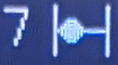

This is a variant of a pulse generator.  It uses a sliding window within a data buffer to determine a set of pulse widths which make up a waveform.

***&#x03F5;*** The position of the sliding window.  Moving this parameter is a bit like tuning an analog radio; the oscillator will move through a range of tonal changes as you move the knob.

## (8) Chirp

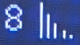

Chirp creates waveforms using sets of exponentially decaying pulses streams.  This model does not tune well across larger frequency gaps.

***&#x03F5;*** changes the relative length of these pulses.

## (9) Multipulse-4

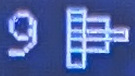

A variant of the multipulse model, with a smaller amount of sub-pulses.

***&#x03F5;*** varies pulse width.

## (10) Low Frequency Noise

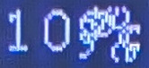

Generates pulse waveforms with randomised pulse width, which creates low-frequency noise.

***&#x03F5;*** varies the maximimum length of the randomised pulse width.

## (11) Bitnoise

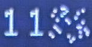

A noise generator with variable tone.  Sounds vary from white(ish) noise to occasional pops and crackles.  This model can be fairly quiet, so it's worth using the shaped outputs for extra gain.

***&#x03F5;*** controls the probability of small changes in a bitstream.

***Frequency*** controls the probability of large changes in a bitstream.

## (12) Silence

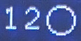

This setting switches off the oscillator bank.  Use this to create thinner sounds.

# Bitwave Synthesis

This is a collection of methods that involve the manipulation of high-frequency binary pulse streams (streams of zeros and ones) which are generated on microcontrollers, and then converted into waveforms using analog circuitry.  The density of the binary streams correlates with the amplitude of the analog waveform.

Bitwave synthesis works at high frequencies, between 1MHz and 16 MHz.  This means that you can avoid artefacts that you might get from digital oscillators, because any digital noise is pushed far above human hearing range, and then removed with analog filtering.  This method also benefits from very high timing and frequency precision.

The collection of methods fall under these categories:

## Variations on delta-sigma modulation

Delta-sigma modulation (DSM) uses an accumulator with feedback to create pulse streams.  You can use this to accurately create waveforms (e.g. the saw and pulse oscillators). You can also play with the feedback look in various ways to change the tone of the waveforms (e.g. sharktooth and trifb models).

## Pulse templates

These methods use a data buffer which spoecifies the width of half or full pulse waves.  The data in these buffers can be manipulated in various ways to change the tone of the oscillator (e.g. the slide model)

## Chirp models

These methods use a state machine that generates chirps: pulse streams whose wavelength decays exponentially.  These pulses can be sequenced to create waveforms.

## Technical Details

Bitwave models run on RP2xxx microcontrollers, taking advantage of the *programmable IO* state machines to generate bitstreams at high frequencies.  The models run in a callback loop, using DMA to feed buffered data into the state machines.  The models vary in speed, depending on how CPU-intensive it is to calculate the buffers.  Each microcontroller core can run three of these models.  Myriad has four cores, but one is saved for non-synthesis tasks: running the meta-modulators, reading the ADCs and drawing the screen.

