Myriad has a selection of *oscillator models*; each one is driven by a digital algorithm, using Bitwave Synthesis. Bitwave is a collection of methods for creating high-frequency streams of binary patterns, that are converted into sound using analog circuitry.  Each model has two paramters of control: frequency and ***&#x03F5;***.  The ***&#x03F5;*** parameter creates tonal changes, and works in a different way with each model.  

## (0) Saw

Generates a saw wave with variable pulse width.

***&#x03F5;*** controls the pulse width of the saw wave, from around 25% of wavelength to 0.25%, moving from a full sound to a thiner sound.

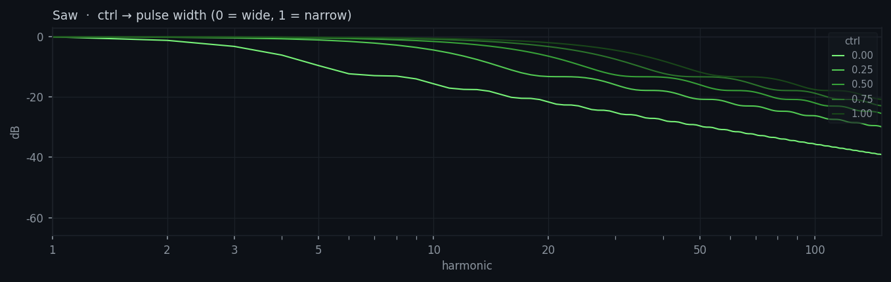



## (1) Chirp

The Chirp oscillator creates sound with sequences of tiny pulses.

***&#x03F5;*** controls how the spread and frequency of the pulses changes, creating tonal variations.

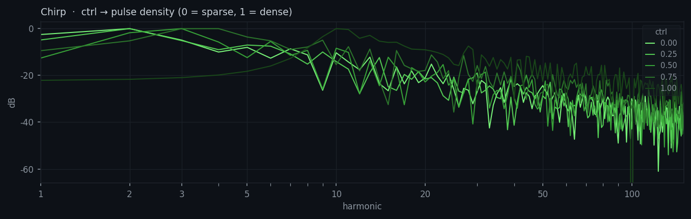



## (2) Sharkteeth

Multiple sawtooth ramps enveloped by a square wave.

***&#x03F5;*** controls the number of teeth per cycle (1 to 20), allowing you to precisely set the dominant upper harmonic.

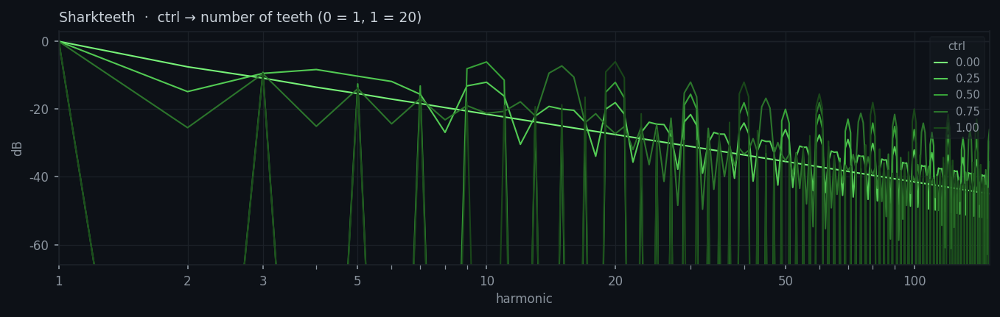



## (3) Pulse

A pulse wave.

***&#x03F5;*** controls the pulse width.

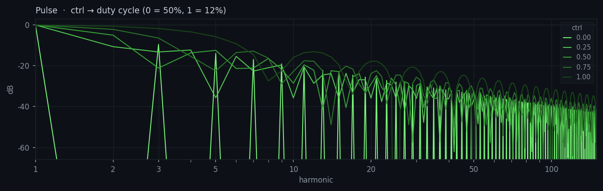



## (4) Resonant Chirp

A variation of the chirp model, with a more resonant tone.

***&#x03F5;*** controls how the width and frequency of the pulses changes, creating tonal variations.

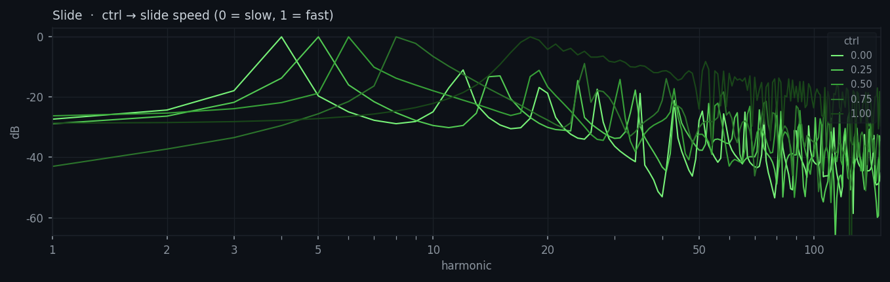



## (5) Triangle

***&#x03F5;*** varies the position of the peak point of the triangle.

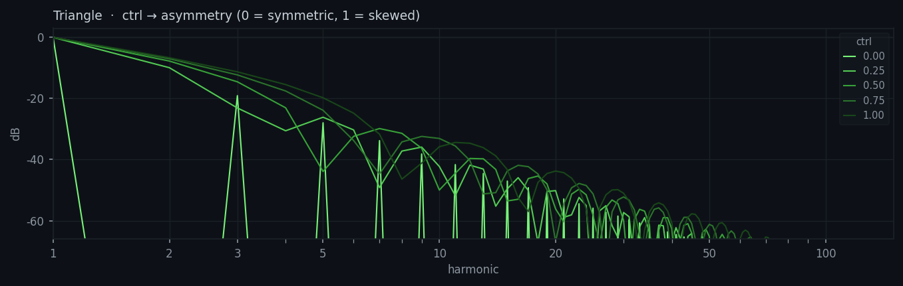



## (6) Piranha

The name will make sense when you see the waveform: a triangle wave with a secondary triangle sub-oscillator running at a higher rate.  The sub-oscillator creates teeth within the triangle envelope, adding harmonics that ride on top of the triangle's natural −12 dB/octave rolloff.

***&#x03F5;*** controls the number of teeth created by the sub-oscillator  — low numbers give a gentle shimmer, high numbers give a dense, bright texture and bite. 

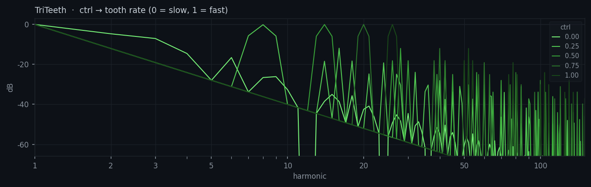



## (7) Parasine

A parabolic approximation of a sine wave oscillator.

***&#x03F5;*** applies waveshaping, adding subtle harmonics.

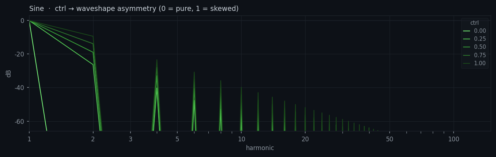



## (8) Formant

An oscillator with voice-like harmonics

***&#x03F5;*** varies from 'ahh' to 'ooo' tonality.

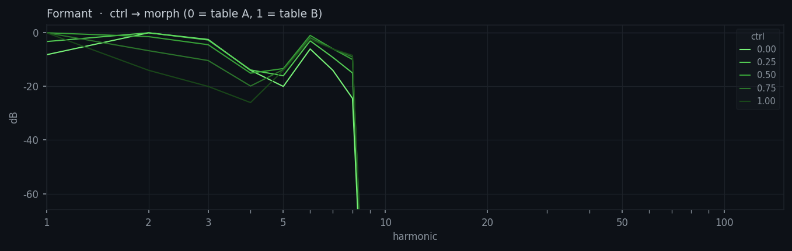



## (9) Metallic

FM style metallic sounds

***&#x03F5;*** increases inharmonic partials.

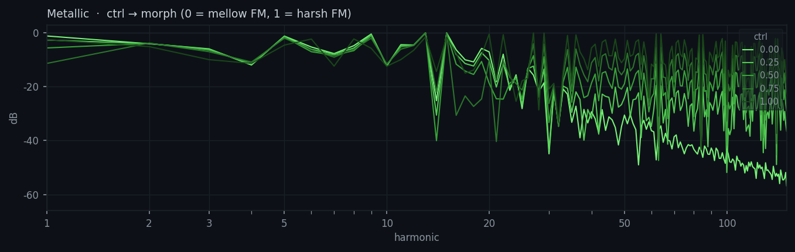



## (10) Random Walk Noise

Generates varied types of noise, using a model of a random walk.

***Frequency*** changes the speed of the random generator, and the balance of low and high frequencies in the noise.

***&#x03F5;*** changes the type of noise.  This control is a bit like tuning a radio; it moves through different sounds from pops and crackles to whistles to full frequency noise.

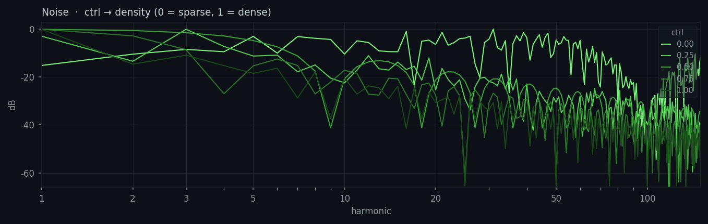



## (11) Bitnoise

A noise generator with variable tone.  Sounds vary from white(ish) noise to occasional pops and crackles.

***&#x03F5;*** controls the probability of small changes in a bitstream.

***Frequency*** controls the probability of large changes in a bitstream.

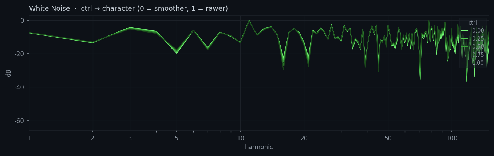



## (12) Silence

This setting switches off the oscillator bank.  Use this to create thinner sounds by switching off banks so that you use less oscillators in the final mix.

<!-- 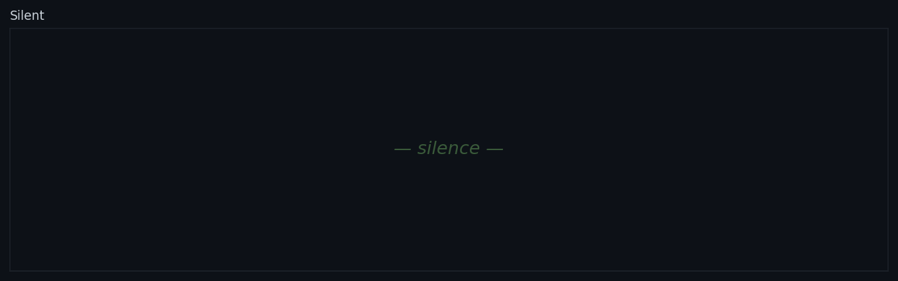 -->

# Bitwave Synthesis

This is a collection of methods that involve the manipulation of high-frequency binary pulse streams (streams of zeros and ones) which are generated on microcontrollers, and then converted into waveforms using analog circuitry.  The density of the binary streams correlates with the amplitude of the analog waveform.

The collection of methods fall under these categories:

## Variations on delta-sigma modulation

Delta-sigma modulation (DSM) uses an accumulator with feedback to create pulse streams.  You can use this to accurately create waveforms (e.g. the saw and pulse oscillators), with either numerical calculation or wavetables. 

## Chirp models

These methods generate sequences of tiny chirps (pulse patterns) that vary over time.  These pulses can be sequenced to create waveforms.

## Noise models

Noise methods use different approaches to random generation of pulse streams.

## Technical Details

Bitwave models run on RP2xxx microcontrollers, taking advantage of the *programmable IO* state machines to generate bitstreams at high frequencies.  The models run in a callback loop, using DMA to feed buffered data into the state machines. Buffers are around 250-500 microseconds long.  The models vary in speed, depending on how CPU-intensive it is to calculate the buffers.  Each microcontroller core can run three of these models.  Myriad has four cores, but one is saved for non-synthesis tasks: running the meta-modulators and drawing the screen.

