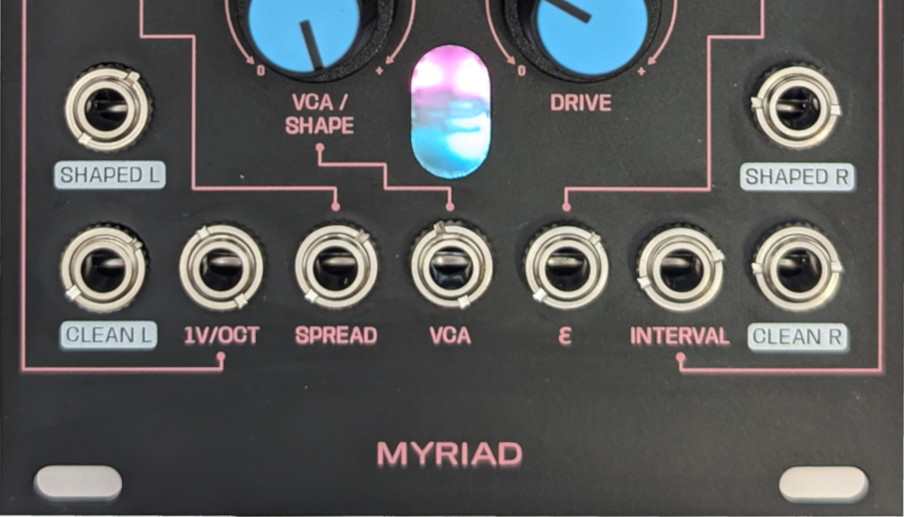
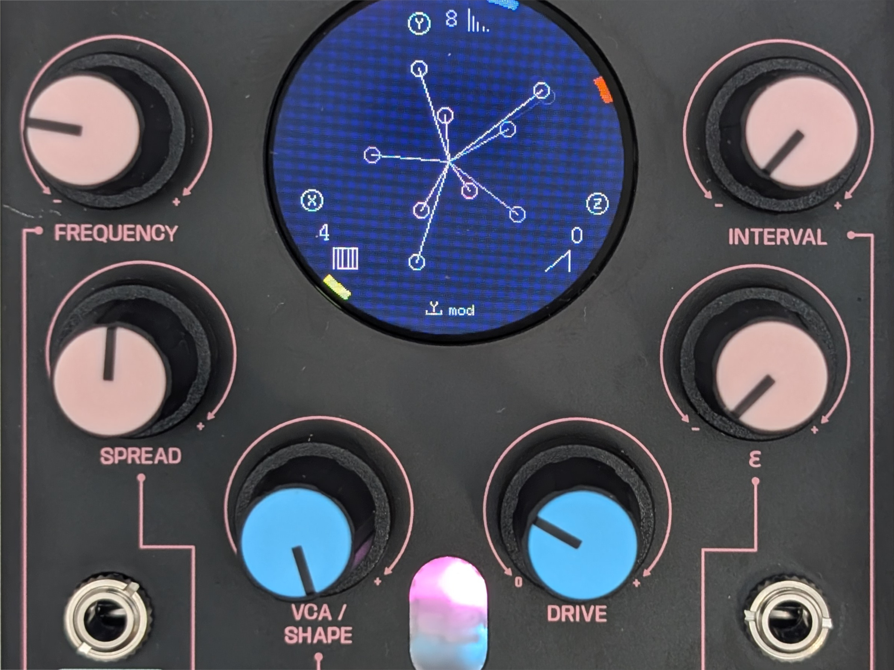
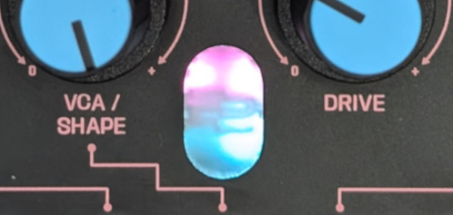
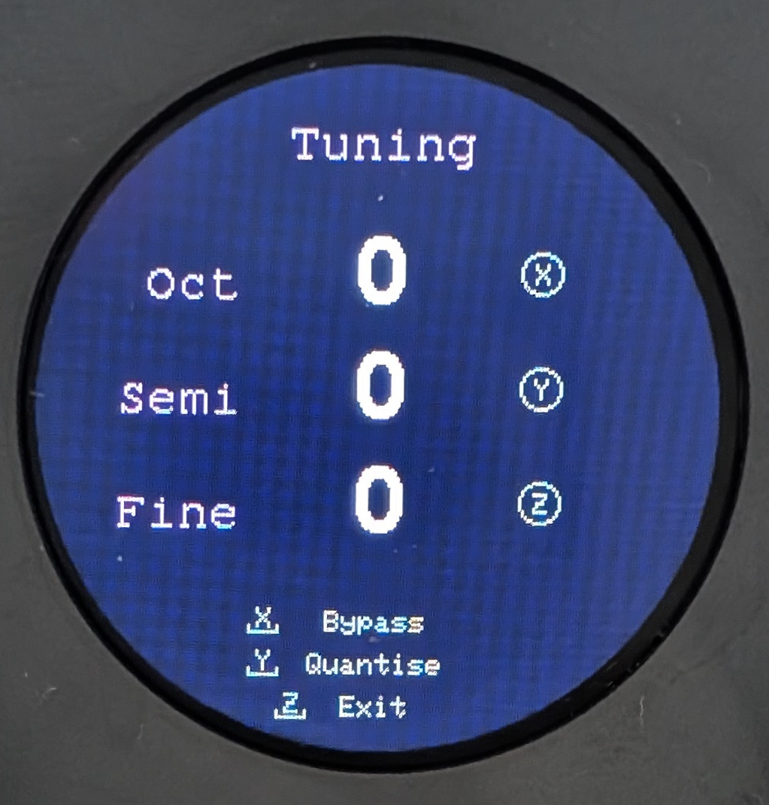
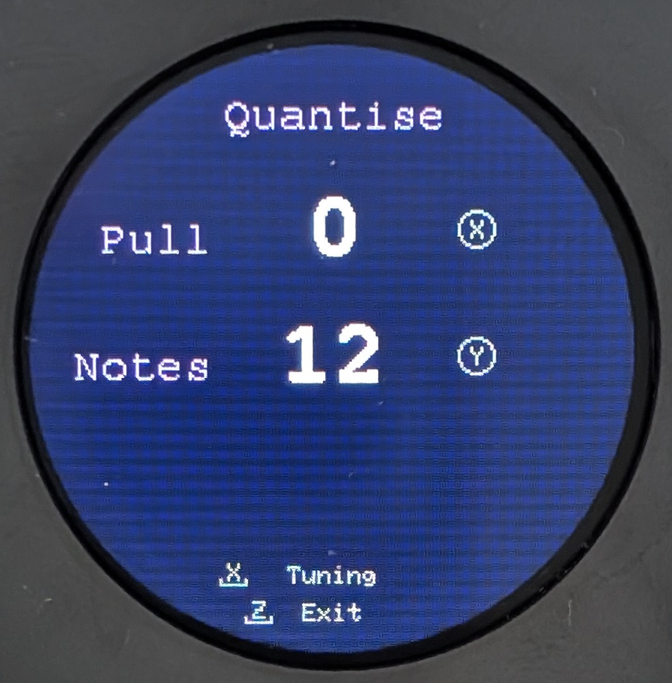
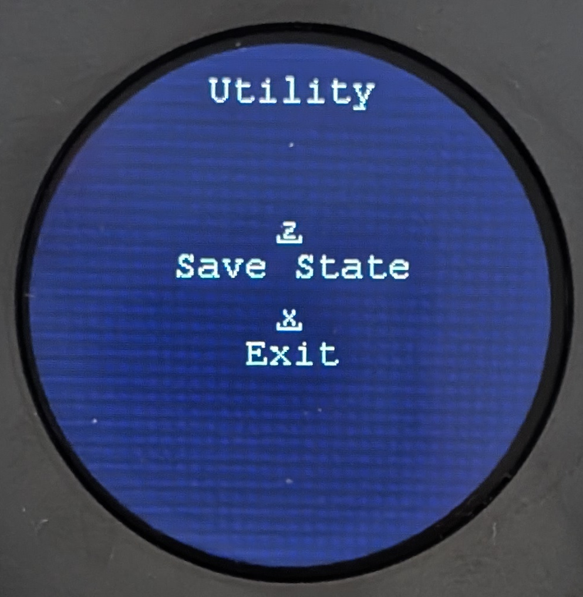

# What does Myriad do?

Myriad is an oscillator designed for the creation of big, complex, dynamic sounds.  At the heart of Myriad, nine oscillators mix, detune and intermodulate together to create complexity, motion and stereo width. Meta-modulation algorithms add more life and movement. Analog waveshaping and overdrive circuits distort and modulate the tone of the oscillators. Five CV inputs give you flexible control options.


# Signal Chain

<pre class="mermaid">
   

flowchart TB
 subgraph O1["Oscillators 1"]
        Osc1["Osc1"]
        Osc2["Osc2"]
        Osc3["Osc3"]
  end
 subgraph O2["Oscillators 2"]
        Osc4["Osc4"]
        Osc5["Osc5"]
        Osc6["Osc6"]
  end
 subgraph O3["Oscillators 3"]
        Osc7["Osc7"]
        Osc8["Osc8"]
        Osc9["Osc9"]
  end
    O1 --> VL["VCA Left"] & VR["VCA Right"]
    O2 --> VL & VR
    O3 --> VL & VR
    VL --> WL["Waveshaping Left"]
    VR --> WR["Waveshaping Right"]
    WL --> DL["Overdrive Left"]
    WR --> DR["Overdrive Right"]
    VL ----> COL(["Clean Output Left"])
    VR ----> COR(["Clean Output Right"]) & COL
    DL --> SOL(["Shaped Output Left"])
    DR --> SOR(["Shaped Output Right"]) & SOL

     Osc1:::gen
     Osc2:::gen
     Osc3:::gen
     Osc4:::gen
     Osc5:::gen
     Osc6:::gen
     Osc7:::gen
     Osc8:::gen
     Osc9:::gen
     VL:::gen
     VR:::gen
     WL:::gen
     WR:::gen
     DL:::gen
     DR:::gen
     COL:::gen
     COR:::gen
     SOL:::gen
     SOR:::gen
     
    classDef gen stroke-width:4px, stroke-dasharray: 0, stroke:#616161, fill:#FFFFFF, color:#424242
    style O1 stroke:#000000,fill:#FFFFFF,color:#000000
    style O2 stroke:#000000,fill:#FFFFFF,color:#000000
    style O3 stroke:#000000,fill:#FFFFFF,color:#000000


</pre>


# Patching 



<iframe width="560" height="315" src="https://www.youtube.com/embed/lJBrkULPvJM?si=x-XDMoFenU2TlPGc&amp;start=415" title="YouTube video player" frameborder="0" allow="accelerometer; autoplay; clipboard-write; encrypted-media; gyroscope; picture-in-picture; web-share" referrerpolicy="strict-origin-when-cross-origin" allowfullscreen></iframe>

## Outputs

Myriad has two sets of [stereo](#stereo-image) outputs. The first set is the *clean* signal, taken from the signal chain before the waveshaping and overdrive section.  The second set is the *shaped* outputs that result from the waveshaping and overdrive.  In each set, the nine oscillators are split, sending four to the left and five to the right channels.  If you plug into a left channel only, then you receive a mono sum of all nine oscillators. If you patch into the corresponding right channel, then this splits the oscillators across the two channels. It's possible to use all of channels or a mixture of clean and shaped at the same time.  

## Inputs

### VCA

There is a control voltage input (0-5V) for the VCA.  For the *clean* outputs, it simply modulates the volume level of the oscillators.  For the *shaped* outputs, it works in tandem with the ```drive```control to add warmth and overdrive to the signal (see [waveshaping and overdrive](#waveshaping-and-overdrive))

### Attenuverted Inputs

The other four inputs (`1V/Oct`, `Spread`, &#x03F5;, `Interval`) map to the lupin coloured knobs.  All of these inputs are bipolar (-5V to +5V) and attenverted.  Attenverting inputs allow you to scale and invert the incoming CV signal.  When turned all the way to the right, the signal is passed through without change. As you turn towards the centre this reduces the scale of the signal towards 0.  Turning the knob from the centre towards the left scales up the signal, but also inverts it i.e. multiplies it by a negative number.  When there's nothing plugged into these inputs, a constant 5V signal is sent to the attenvertor, meaning than moving the knob gives you a signal in the range of -5V to +5V.  


# Controls



## Oscillator Controls

### Frequency

Controls the base frequency of the oscillators (see the [tuning](#pitch-and-tuning)). Calculation of the frequencies of the nine oscillators depend on this frequency, along with `spread`, `interval` and meta-modulation.

### Spread

This controls how much the oscillators are detuned from each other.  The mapping range allows from small or subtle beating, to wider discordant frequency intervals.

### ***&#x03F5;***

Each oscillator model might react in a different manner to this control. See [oscilator models](oscmodels.md) for more info.

### Interval

This control changes how the pitch of the oscillators is spread across octaves.  At zero, there is no modification.  As you move the control away from zero, you move across sixteen different settings, which are different combinations of how the oscillators spread in pitch.  The mappings are designed to spread octaves within each oscillator bank, and also across the banks.

## Waveshaping and Overdrive

The waveshaping section is controlled by the blue-capped knobs, ```VCA/Shape``` and ```Drive```.  These two controls work in tandem to add warmth and dirt to the sound.  This circuitry they control consists of a two-stage wave folder followed by an overdrive.  

### Waveshaping 

The waveshaper, when driven by the VCA, folds the signal over a certain threshold. For simple waveforms, this adds harmonics. For complex waveforms (e.g. with significant detuning), the waveshaper can act in intersting, noisy and unpredictable ways. The amount of waveshaping is determined by the VCA.

### Overdrive

The overdrive section clips the signal using the pink and blue LEDs visible through the front panel. This clipping creates extra harmonics.  Like the waveshaper, the overdrive can behave in unpredictable ways when processing complex intermodulating signals.  The level of overdrive is controlled by the `drive` knob.

## Digital Controls

<pre class="mermaid">
---
config:
  layout: elk
---
flowchart TB
 subgraph key["Key"]
        keyA[" "]
        keyTurn["Turn Encoder"]
        keyPush["Push Encoder"]
  end
 subgraph Tuning["Tuning"]
    direction TB
        toct["Octave"]
        tun["Tuning Screen"]
        tsemi["Semitone"]
        tcent["Cent"]
        pbypass["Bypass"]
  end
 subgraph subGraph1["Oscillator Models"]
    direction LR
        osc1["Oscillator Model 1"]
        A["Oscillator Screen"]
        osc2["Oscillator Model 2"]
        osc3["Oscillator Model 3"]
  end
 subgraph subGraph2["Meta Modulation"]
    direction TB
        mods["Modulation Speed"]
        B["Meta Modulation Screen"]
        modmode["Modulation Mode"]
        modd["Modulation Depth"]
  end
 subgraph quantise["Quantise"]
    direction TB
        quan["Quantise Screen"]
        tpull["Pull"]
        tnotes["Notes"]
  end
 subgraph utility["Utility"]
        util["Utility Screen"]
        save["Save"]
  end
    keyA -- encoder --o keyTurn
    keyA -- encoder --x keyPush
    A x-- Y ----x B
    A x-- Z ------x tun
    tun -- X --o toct
    tun -- Y --o tsemi
    tun -- Z --o tcent
    tun -- X --x pbypass
    tun -- Y ----x quan
    quan -- X --x tun
    quan -- X --o tpull
    quan -- Y --o tnotes
    A -- X --o osc1
    A -- Y --o osc2
    A -- Z --o osc3
    B -- X --o mods
    B -- Y --o modmode
    B -- Z --o modd
    A -- X --x util
    util -- Z --x save
    save ----> A
     keyTurn:::defc
     keyPush:::defc
     toct:::defc
     tun:::defc
     tsemi:::defc
     tcent:::defc
     pbypass:::defc
     osc1:::defc
     A:::defc
     osc2:::defc
     osc3:::defc
     mods:::defc
     B:::defc
     modmode:::defc
     modd:::defc
     quan:::defc
     tpull:::defc
     tnotes:::defc
     util:::defc
     save:::defc
    classDef defc fill:#fff, stroke-width:4px, stroke-dasharray: 0, stroke:#424242, color:#000000
    style subGraph1 stroke:#000000,fill:transparent,color:#000000
    style subGraph2 stroke:#000000,fill:transparent,color:#000000
    style Tuning stroke:#000000,fill:transparent,color:#000000
    style quantise stroke:#000000,fill:transparent,color:#000000
    style utility stroke:#000000,fill:transparent,color:#000000
    style key stroke:#000000,fill:transparent,color:#333333


</pre>

# Visuals

## Overdrive LEDs



The overdrive circuitry uses LEDs to help create distortion and warmth.  Each stereo channel has two LEDs (pink and blue) which clip the signal when over or under certain voltages. These LEDs are visible through the front panel.

## Screens

There are two main screens, alternated by pushing the ```Y``` encoder.

### Oscillator Screen

This shows information on the currently selected oscillator models for each bank, and also shows a visualisation of the relative frequencies of the oscillators.  Each of the nine oscillators is represented by a rotating line ending with a circle. The colour of the line matches the bank to which the oscillator belongs. The line rotates at a speed that increates with the frequency of the oscillator.

### Meta-Modulation Screens

Each meta-modulator shows a visualisation of its algorithm.  Rotating `X` changes the speed and possibly other variables of the algorithm. Rotating `Z` changes the depth of modulation.

# Tuning and Quantisation

Tuning is centred on C1 at 0V, and is sensitive in a 10V range from C-4 to C6.  Not all oscillator models will be able to reach the outer limits of this range.  

Incoming control voltages are attenuverted, so if the incoming pitch range is centred around 0V, then the attenuverter will be able effectively invert and scale pitch CV.  If the voltage range is not centred around 0V, this will skew the effects of the attenuverter. Either way,  if the attenverter is set all the way to 100%, then the incoming pitch CV will be directly reflected in the frequency control of the oscillators.

<iframe width="560" height="315" src="https://www.youtube.com/embed/lJBrkULPvJM?si=SFfS5rv0OIXlf6O_&amp;start=415" title="YouTube video player" frameborder="0" allow="accelerometer; autoplay; clipboard-write; encrypted-media; gyroscope; picture-in-picture; web-share" referrerpolicy="strict-origin-when-cross-origin" allowfullscreen></iframe>



Press `Z` to enter Tuning mode from Oscillator mode. Press it again to exit."

The tuning screen allows adjustment of octaves, semitones and cents.  These settings will affect both incoming pitch CV and also the effect of the frequenc control. Tuning can be bypassed

When exiting the Tuning screen, the settings are saved to flash memory and will persist after power cycles.  While saving there may be a small audio pause while the processor writes the data.

## Quantisation



Press `Y` to enter Quantisation and `X` to then return to Tuning mode.

The quantisation screen has two controls: `pull` and `notes`.  `pull` moves between 0% and 100%. If set to more than zero, then the incoming frequency control will be quantised towards the nearest note.  This nearest note is determined by the setting `notes` which sets the number of notes in an octave.  Conventionally this is 12 notes for western tuning, but you can experiment with other settings to give microtonal tunings, or coarse tunings with fewer notes per octave. All quantisations use equal-temprament.

# Stereo Image

Myriad takes an unconventional approach to stereo imaging: the stereo field is created by tonal differences and intermodulation between the nine oscillators, and by analog sound processing.  Four oscillators are sent to the left channel, and the remaining five to the right.  With `spread` and `interval` controls set to 0, and all three banks set to the same model, the image will be effectively mono. As the differnces across the models widens, so might the stereo image.   The stereo image can be influenced as follows:

## Use a mixture of oscillator models

This will send mixed waveforms to each channel, creating differences between the two sides.

## Using the `spread` control

This will alter the balance of frequencies in each channel.  Intermodulation between these frequencies will create panning effects

## Using the `interval` control

This will create wider frequency variation across the oscillators in each channel, and therefore bigger difference across the stereo field.

## Using `VCA` and `Drive`

The *shaped* outputs can be very nonlinear, and therefore accentuate intermodulation products between the two channels.  These products create subtle to strong panning, and can be controlled by the VCA level and overdrive level.  The panning is visible in the overdrive LEDs.

# Saving State



Myriad can preserve it's current state so that it's loaded when you next power on the module. The state consists of:

1. Choice of model for each oscillator bank
2. Choice of meta-modulator
3. Meta-modulator depth, speed and modulation target.

Press `X` from the oscillator screen to open the Utility screen, and then press `Z` to save.  When you save, you may hear a small glitch in the audio, This is because the microcontroller needs to pause other processes in order to safely write to the flash memory on the PCB.


